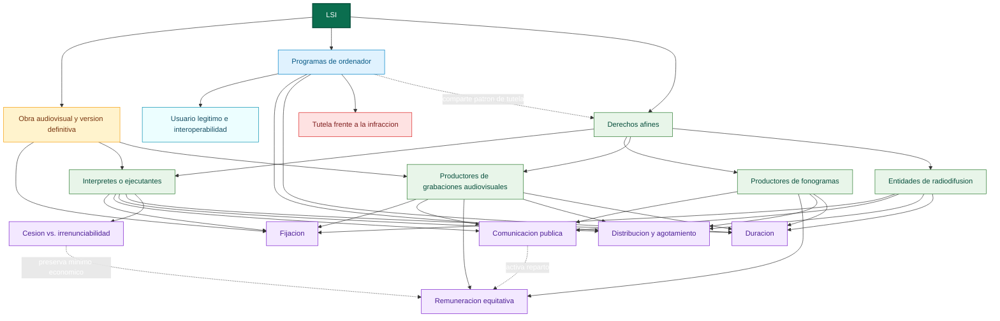

# Iteracion 02: mapa integrador de nivel 1 de la LSI

## Funcion de esta iteracion

Esta iteracion deja de tratar cada apartado como isla y los integra en una primera arquitectura comun. El objetivo no es cerrar aun el mapa total, sino hacer visibles las relaciones transversales que ya pueden afirmarse con el material consolidado.

## Pregunta de enfoque

Como se articulan entre si la proteccion del software, la obra audiovisual como puente y los derechos afines de interpretes, productores y entidades de radiodifusion dentro de una misma red conceptual de la LSI?

## Mapas integrados en esta iteracion

- [00_preliminar_obras_audiovisuales_art_91_94_mapa.md](../../titulo7/00_preliminar_obras_audiovisuales_art_91_94_mapa.md)
- [01_titulo_vii_programas_de_ordenador_mapa.md](../../titulo7/01_titulo_vii_programas_de_ordenador_mapa.md)
- [02_titulo_i_artistas_interpretes_o_ejecutantes_parcial_submapa.md](../../titulo7/02_titulo_i_artistas_interpretes_o_ejecutantes_parcial_submapa.md)
- [00_preliminar_programas_ordenador_art_103_104_mapa.md](../../titulo123/00_preliminar_programas_ordenador_art_103_104_mapa.md)
- [01_titulo_i_artistas_interpretes_o_ejecutantes_mapa.md](../../titulo123/01_titulo_i_artistas_interpretes_o_ejecutantes_mapa.md)
- [02_titulo_ii_productores_fonogramas_mapa.md](../../titulo123/02_titulo_ii_productores_fonogramas_mapa.md)
- [03_titulo_iii_productores_grabaciones_audiovisuales_mapa.md](../../titulo123/03_titulo_iii_productores_grabaciones_audiovisuales_mapa.md)
- [04_titulo_iv_entidades_radiodifusion_mapa.md](../../titulo123/04_titulo_iv_entidades_radiodifusion_mapa.md)

## Nuevas relaciones transversales

- Obra audiovisual -> se estabiliza en -> version definitiva.
- Version definitiva -> incorpora -> actuaciones protegidas.
- Version definitiva -> presupone -> fijacion audiovisual explotable.
- Programas de ordenador -> comparten con los derechos afines -> una logica de explotacion, duracion y tutela, aunque su objeto protegido sea distinto.
- Programas de ordenador -> concentran un limite especifico en -> usuario legitimo e interoperabilidad.
- Interpretes -> son el nodo personal que conecta -> fijacion, comunicacion publica, distribucion, remuneracion y derechos morales.
- Productores de fonogramas -> comparten con interpretes -> remuneracion equitativa por comunicacion publica.
- Publicacion o comunicacion licita en fonograma -> extiende a 70 anos -> duracion del interprete y del productor fonografico.
- Productores de grabaciones audiovisuales -> conectan la fijacion de imagen y sonido con -> la comunicacion publica y la explotacion empresarial.
- Entidades de radiodifusion -> anaden una capa autonoma de proteccion sobre -> la emision, su fijacion, reproduccion, retransmision y distribucion.
- Cesion a productores -> no elimina siempre -> remuneracion irrenunciable del interprete.
- Tutela frente a la infraccion -> aparece expresamente en software y queda reservada como eje comun para futuras iteraciones del resto de derechos.

## Estructura de integracion

### Capa 1. Macrodominios

- LSI.
- Programas de ordenador.
- Derechos afines.
- Obra audiovisual como nodo puente.

### Capa 2. Nodos puente comunes

- fijacion
- comunicacion publica
- distribucion y agotamiento
- remuneracion equitativa
- duracion
- cesion frente a irrenunciabilidad
- tutela frente a la infraccion

### Capa 3. Sujetos y objetos juridicos que se integran

- interpretes o ejecutantes
- productores de fonogramas
- productores de grabaciones audiovisuales
- entidades de radiodifusion
- usuario legitimo e interoperabilidad en software

## Lectura recomendada del mapa

- Leer de arriba abajo para ver la jerarquia general.
- Leer en diagonal desde obra audiovisual hacia interpretes y productores audiovisuales para captar el puente entre obra y fijacion.
- Leer de izquierda a derecha desde software hacia tutela para seguir el eje informatico.
- Leer desde interpretes hacia fonogramas y radiodifusion para captar la red de explotacion y remuneracion.

## Reserva para la siguiente iteracion

- Introducir un mapa integrador de nivel 2 centrado en palabras de enlace juridicas: autoriza, presume, remunera, agota, dura, tutela.
- Reinyectar en el mapa global los articulos concretos mas productivos: 92, 99, 100, 108, 110 bis, 116, 122, 126.
- Decidir si el mapa total final se divide en dos laminas draw.io: software y derechos afines, o si se mantiene en una sola superficie.

## Diagrama Mermaid de integracion

