# Iteracion 03: mapa final integrado de la LSI trabajada

## Revision de la iteracion 02

La iteracion 02 cumplia bien una funcion de mapa macro, pero no conservaba visible todo el contenido de los mapas fuente. La perdida principal se producia cuando varios articulos distintos quedaban absorbidos en nodos puente demasiado amplios.

- En software se comprimian objeto protegido, titularidad, limites concretos, registro, infraccion y concurrencia normativa.
- En interpretes quedaban demasiado resumidos el tramo 105-108, la forma escrita, la puesta a disposicion, el alquiler y prestamo, el art. 110 bis, la representacion colectiva y los derechos morales.
- En productores faltaba dejar a la vista importacion y exportacion, legitimacion activa, fotografias del proceso y reordenacion temporal por divulgacion licita.
- En radiodifusion existia contenido juridico en el corpus, pero faltaba su mapa conceptual propio en la carpeta de mapas.

Esta iteracion cierra esas perdidas mediante una integracion final basada en jerarquia, agrupacion por ramas y enlaces cruzados explicitados con palabras de enlace juridicas.

## Pregunta de enfoque

Como puede organizarse en un solo mapa final todo el contenido ya trabajado sobre software, obra audiovisual y derechos afines sin perder conceptos juridicos relevantes y manteniendo una jerarquia conceptual legible?

## Corpus integrado en el mapa final

- [00_preliminar_obras_audiovisuales_art_91_94_mapa.md](../../titulo7/00_preliminar_obras_audiovisuales_art_91_94_mapa.md)
- [01_titulo_vii_programas_de_ordenador_mapa.md](../../titulo7/01_titulo_vii_programas_de_ordenador_mapa.md)
- [02_titulo_i_artistas_interpretes_o_ejecutantes_parcial_submapa.md](../../titulo7/02_titulo_i_artistas_interpretes_o_ejecutantes_parcial_submapa.md)
- [00_preliminar_programas_ordenador_art_103_104_mapa.md](../../titulo123/00_preliminar_programas_ordenador_art_103_104_mapa.md)
- [01_titulo_i_artistas_interpretes_o_ejecutantes_mapa.md](../../titulo123/01_titulo_i_artistas_interpretes_o_ejecutantes_mapa.md)
- [02_titulo_ii_productores_fonogramas_mapa.md](../../titulo123/02_titulo_ii_productores_fonogramas_mapa.md)
- [03_titulo_iii_productores_grabaciones_audiovisuales_mapa.md](../../titulo123/03_titulo_iii_productores_grabaciones_audiovisuales_mapa.md)
- [04_titulo_iv_entidades_radiodifusion_mapa.md](../../titulo123/04_titulo_iv_entidades_radiodifusion_mapa.md)

## Criterio de integracion final

- La raiz es una sola pregunta de enfoque y no una suma de capitulos.
- Los conceptos generales se ubican arriba y los especificos descienden por ramas juridicas coherentes.
- Cada rama conserva los conceptos propios de su bloque antes de conectarse con otras ramas.
- Los enlaces cruzados se usan solo cuando relacionan ramas distintas y anaden significado juridico nuevo.
- El submapa parcial de interpretes no desaparece: queda absorbido en la rama completa del Titulo I mediante sujeto protegido, fijacion escrita, reproduccion, comunicacion publica, puesta a disposicion, transferencia presumida, remuneracion irrenunciable y entidades de gestion.

## Decision de alcance para la version final pedida

- La version final se centra en los Titulos I, II, III y VII de la LPI, porque son los solicitados y forman una cadena conceptual cerrada entre objeto protegido, fijacion, explotacion, remuneracion y tutela.
- El bloque de radiodifusion se mantiene solo como apoyo contextual externo: ayuda a imaginar la difusion final, pero no es necesario para explicar la relacion estructural entre software, interpretes, fonogramas y grabaciones audiovisuales.

## Agrupacion jerarquica sin perdida de contenido

### 1. Programas de ordenador

- Regimen especial: el software tiene disciplina propia dentro de la ley y remite al resto de la norma en lo no previsto especificamente.
- Objeto protegido: originalidad, forma de expresion, documentacion preparatoria, documentacion tecnica y manuales con la misma proteccion, versiones sucesivas y programas derivados (salvo los creados para causar efectos nocivos).
- Exclusiones y concurrencia: ideas y principios fuera de la proteccion autoral, con convivencia con propiedad industrial y otras ramas (patentes, marcas, semiconductores, secretos, competencia desleal).
- Titularidad y duracion: autoria individual, obra colectiva (editor como autor salvo pacto), colaboracion y software asalariado con explotacion empresarial salvo pacto; persona natural con la duracion general del Libro I y persona juridica con 70 anos desde divulgacion licita o desde la creacion.
- Explotacion: reproduccion total o parcial incluso transitoria, transformacion y distribucion publica incluido el alquiler; cesion de uso no exclusiva e intransferible salvo prueba en contrario; agotamiento de la primera venta en la UE salvo alquiler.
- Limites: uso necesario, correccion de errores, copia de seguridad no impedible por contrato, observacion y estudio del funcionamiento, descompilacion indispensable para interoperabilidad bajo condiciones estrictas sin legitimar copia sustancialmente similar; cesionario titular de explotacion puede realizar versiones sucesivas sin oposicion del autor salvo pacto.
- Registro: programa, versiones y derivados.
- Infraccion y tutela: actos no autorizados, copias ilegitimas, tenencia comercial, instrumentos de neutralizacion, acciones, procedimientos y medidas cautelares.
- Concurrencia normativa: patentes, marcas, competencia desleal, secretos comerciales, semiconductores y derecho de obligaciones.

### 2. Obra audiovisual como nodo puente

- Aportacion incompleta del autor: uso parcial por el productor con respeto de derechos e indemnizacion.
- Version definitiva: cierre de la obra audiovisual pactado entre director-realizador y productor.
- Modificacion: requiere autorizacion de quienes fijaron la version definitiva.
- Ajustes para radiodifusion: solo se presumen cuando la programacion los exige.
- Derecho moral y soporte: el derecho moral se concentra en la version definitiva y el soporte original no puede destruirse.
- Extension analogica: las obras radiofonicas reciben aplicacion del regimen audiovisual.

### 3. Interpretes o ejecutantes

- Sujeto protegido: incluye al director de escena y al director de orquesta.
- Derechos exclusivos iniciales: fijacion por escrito, reproduccion por escrito, comunicacion publica y puesta a disposicion.
- Excepcion de comunicacion publica: la actuacion que en si misma constituye emision de radiodifusion o que se realiza desde una fijacion previamente autorizada no requiere nueva autorizacion del interprete.
- Distribucion y circulacion: derecho exclusivo de distribucion, agotamiento en la UE, alquiler con beneficio economico y prestamo sin beneficio economico a traves de establecimientos accesibles al publico.
- Cesion y contratos: presunciones de transferencia a productores, contratos de trabajo o servicios vinculados al art. 47 y adquisicion empresarial de facultades segun la naturaleza y el objeto del contrato.
- Derecho de revocacion: el art. 48 bis y las obligaciones de informacion del art. 75 RDL 24/2021 son aplicables al cesionario o licenciatario.
- Limite economico a la cesion: remuneraciones irrenunciables, remuneracion equitativa y unica por fonogramas comerciales, remuneracion por determinados usos audiovisuales y entidades de gestion.
- Proteccion reforzada: si el fonograma no se explota suficientemente a los 50 anos, procede la resolucion de la cesion y, cuando hubo remuneracion unica, nace una remuneracion anual adicional del 20 por ciento de los ingresos brutos de explotacion.
- Organizacion del sujeto: representante para actuaciones colectivas.
- Tiempo y moral: tres tramos de duracion (50 base, 50 desde publicacion por medio distinto al fonograma, 70 si fonograma), derecho al nombre, integridad y control del doblaje en lengua propia.

### 4. Productores de fonogramas

- Objeto y sujeto: fonograma como fijacion exclusivamente sonora y productor como iniciativa y responsabilidad de la primera fijacion.
- Derechos exclusivos: reproduccion, comunicacion publica y distribucion.
- Efectos economicos: remuneracion equitativa compartida con interpretes por el uso de fonogramas comerciales en comunicacion publica, excepto la puesta a disposicion del art. 20.2.i; a falta de acuerdo, se reparte por partes iguales y se gestiona mediante entidades de gestion.
- Circulacion: importacion, exportacion comercial, alquiler (puesta a disposicion con beneficio economico), prestamo (puesta a disposicion sin beneficio economico a traves de establecimientos publicos) y agotamiento en la UE.
- Tutela: legitimacion activa del productor y del cesionario.
- Tiempo: duracion de 50 anos desde la grabacion, ampliable a 70 por publicacion o comunicacion licita al publico dentro del periodo.

### 5. Productores de grabaciones audiovisuales

- Objeto y sujeto: grabacion de imagenes con o sin sonido, sea o no calificable como obra audiovisual del art. 86, con iniciativa y responsabilidad del productor.
- Derechos exclusivos: reproduccion, comunicacion publica y distribucion.
- Remuneracion: los usos de comunicacion publica previstos en el art. 20.2.f y g activan remuneracion segun tarifas de la entidad de gestion, gestionada por entidades de gestion.
- Circulacion: alquiler (con beneficio economico), prestamo (sin beneficio economico a traves de establecimientos publicos) y agotamiento en la UE.
- Extension del objeto: fotografias realizadas durante el proceso de produccion de la grabacion audiovisual.
- Tiempo: 50 anos desde la realizacion; si la grabacion se divulga licitamente dentro del periodo, el computo se restablece en 50 anos desde la fecha de divulgacion.

## Enlaces cruzados que dan unidad al mapa

- Version definitiva -> incorpora -> actuaciones protegidas.
- Version definitiva -> presupone -> fijacion audiovisual explotable.
- Fonograma comercial comunicado publicamente -> activa -> remuneracion equitativa compartida entre interpretes y productores (excepto puesta a disposicion del art. 20.2.i), con reparto por mitad a falta de acuerdo.
- Grabacion audiovisual usada para actos del art. 20.2.f y g -> activa -> remuneracion para interpretes y productores audiovisuales segun tarifas de la entidad de gestion.
- Entidades de gestion -> son el mecanismo operativo transversal de todas las remuneraciones equitativas irrenunciables en derechos afines.
- Cesion contractual del interprete -> no extingue -> remuneraciones irrenunciables ni la reaccion correctora del art. 110 bis.
- Alquiler (con beneficio economico) y prestamo (sin beneficio economico, a traves de establecimientos publicos) -> aparecen como conceptos comunes en interpretes, fonogramas, grabaciones audiovisuales y software.
- Grabacion audiovisual -> puede incorporar -> actuaciones protegidas, aunque no toda grabacion de imagenes con o sin sonido sea obra audiovisual en sentido estricto.
- Software -> comparte con derechos afines -> patron de derechos exclusivos, limites, duracion e infraccion, aunque proteja un objeto distinto.
- Interoperabilidad -> no autoriza -> copia sustancialmente similar del programa descompilado.
- Descompilacion para interoperabilidad -> singulariza -> el eje tecnologico del software frente al resto de ramas.
- Cesionario titular de explotacion de software -> puede versionar sin oposicion del autor -> al igual que el productor puede explotar la fijacion segun contrato.

## Lectura recomendada del mapa final

- Leer de arriba abajo para seguir la jerarquia desde LSI estudiada hasta cada objeto y sujeto protegido.
- Leer primero cada rama de manera autonoma y solo despues los enlaces cruzados.
- Leer en diagonal desde obra audiovisual hacia interpretes y productores audiovisuales para captar el papel bisagra de la version definitiva.
- Leer de izquierda a derecha desde software hacia tutela para separar claramente el eje tecnologico del eje de fijaciones sonoras y audiovisuales.

## Diagrama Mermaid del mapa final

```mermaid
flowchart TB
    LSI["LPI trabajada: Titulos I, II, III y VII"]:::root
    SOF["Programas de ordenador (Titulo VII)"]:::soft
    OAV["Obra audiovisual y version definitiva"]:::focus
    DAF["Derechos afines (Titulos I, II y III)"]:::concept

    SOBJ["Regimen especial, originalidad y documentacion con igual proteccion"]:::softDetail
    STIT["Titularidad y duracion de persona natural o juridica"]:::softDetail
    SEXPL["Reproduccion, transformacion, distribucion y agotamiento UE"]:::softDetail
    SLIM["Uso legitimo, copia de seguridad e interoperabilidad sin copia similar"]:::softDetail
    SREG["Registro de programa, versiones y derivados"]:::softDetail
    SINF["Infraccion: copias ilegitimas y neutralizacion tecnica"]:::warning
    STUT["Acciones, cautelares y concurrencia normativa"]:::warning

    OAP["Aportacion incompleta"]:::detail
    OVD["Version definitiva"]:::focus
    OMOD["Modificacion autorizada"]:::detail
    OMOR["Derecho moral y soporte original"]:::detail
    ORRF["Obras radiofonicas por analogia"]:::bridge

    INT["Interpretes o ejecutantes"]:::concept
    IFIX["Fijacion, reproduccion, comunicacion publica y excepcion de radiodifusion"]:::detail
    IDIS["Puesta a disposicion, distribucion y agotamiento UE"]:::detail
    IREM["Remuneracion irrenunciable y entidades de gestion"]:::bridge
    ICES["Cesion a productores, alquiler, prestamo y trabajo o servicios"]:::bridge
    I110["Art. 110 bis: resolucion tras 50 anos y 20 por ciento adicional"]:::bridge
    ICOL["Representante, duracion y derechos morales"]:::detail

    FON["Productores de fonogramas"]:::concept
    FFON["Fonograma, iniciativa y responsabilidad"]:::detail
    FEXP["Reproduccion, comunicacion publica y distribucion"]:::detail
    FREM["Remuneracion compartida y reparto igual salvo acuerdo"]:::bridge
    FCIR["Importacion, exportacion, alquiler, prestamo, agotamiento y legitimacion"]:::detail
    FDUR["Duracion 50 o 70 anos"]:::detail

    GRA["Productores de grabaciones audiovisuales"]:::concept
    GOBJ["Grabacion audiovisual, iniciativa y objeto mas amplio que obra audiovisual"]:::detail
    GEXP["Reproduccion, comunicacion publica y distribucion"]:::detail
    GREM["Remuneracion art. 20.2.f y g y entidades de gestion"]:::bridge
    GFOT["Alquiler, prestamo, fotografias del proceso y agotamiento"]:::detail
    GDUR["Duracion y divulgacion licita"]:::detail

    LSI -- "se organiza en" --> SOF
    LSI -- "se articula con" --> OAV
    LSI -- "se despliega en" --> DAF

    SOF -- "incluye" --> SOBJ
    SOF -- "incluye" --> STIT
    SOF -- "incluye" --> SEXPL
    SOF -- "queda limitado por" --> SLIM
    SOF -- "permite" --> SREG
    SOF -- "desemboca en" --> SINF
    SINF -- "habilita" --> STUT

    OAV -- "incluye" --> OAP
    OAV -- "culmina en" --> OVD
    OVD -- "solo admite" --> OMOD
    OVD -- "concentra" --> OMOR
    OAV -- "se extiende a" --> ORRF

    DAF -- "incluye" --> INT
    DAF -- "incluye" --> FON
    DAF -- "incluye" --> GRA

    INT -- "comprende" --> IFIX
    INT -- "incluye" --> IDIS
    INT -- "mantiene" --> IREM
    INT -- "contrata y cede mediante" --> ICES
    INT -- "refuerza con" --> I110
    INT -- "mantiene" --> ICOL

    FON -- "se apoya en" --> FFON
    FON -- "ejerce" --> FEXP
    FEXP -- "genera" --> FREM
    FON -- "circula mediante" --> FCIR
    FON -- "dura" --> FDUR

    GRA -- "se apoya en" --> GOBJ
    GRA -- "ejerce" --> GEXP
    GEXP -- "puede generar" --> GREM
    GRA -- "incluye" --> GFOT
    GRA -- "dura" --> GDUR

    OVD -. "incorpora actuaciones" .-> INT
    OVD -. "presupone fijacion explotable" .-> GRA
    ICES -. "puede ceder a" .-> FON
    ICES -. "puede ceder a" .-> GRA
    IREM -. "se comparte con" .-> FREM
    GREM -. "se conecta con" .-> IREM
    I110 -. "corrige cesiones insuficientemente explotadas" .-> FON
    SOF -. "comparte patron de derechos, limites y tutela" .-> DAF

    classDef root fill:#0B6E4F,stroke:#064E3B,color:#FFFFFF,stroke-width:2px;
    classDef concept fill:#E8F5E9,stroke:#2E7D32,color:#064E3B;
    classDef detail fill:#F1F8E9,stroke:#66BB6A,color:#1B5E20;
    classDef bridge fill:#FFF3CD,stroke:#F59E0B,color:#78350F;
    classDef focus fill:#FEF3C7,stroke:#D97706,color:#78350F;
    classDef soft fill:#E0F2FE,stroke:#0284C7,color:#075985;
    classDef softDetail fill:#ECFEFF,stroke:#0891B2,color:#164E63;
    classDef warning fill:#FEE2E2,stroke:#DC2626,color:#7F1D1D;
```

