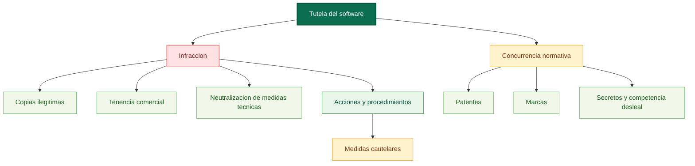

# Submapa conceptual: tutela del software (arts. 103-104 y cierre del 102)

Fuente base: [00_preliminar_programas_ordenador_art_103_104.md](../../../LSI/titulo123_capitulos/00_preliminar_programas_ordenador_art_103_104.md)

Relaciones base: [00_preliminar_programas_ordenador_art_103_104_relaciones.md](../../../LSI/titulo123_capitulos/00_preliminar_programas_ordenador_art_103_104_relaciones.md)

## Funcion dentro del mapa global

Este submapa recoge el cierre procesal y sistematico del software. No redefine el programa de ordenador, sino que concentra el paso desde la infraccion hasta la tutela y la coexistencia con otras ramas juridicas.

## Pregunta de enfoque

Como responde juridicamente la ley cuando el derecho sobre software ya ha sido lesionado y como evita que ese regimen cierre el paso a otras protecciones concurrentes?

## Desglose por articulos

- Cola del art. 102: considera infractores a quienes ponen en circulacion copias ilegitimas, las poseen con fines comerciales o trafican con instrumentos para neutralizar dispositivos tecnicos de proteccion.
- Art. 103: permite al titular ejercitar acciones y procedimientos generales, junto con las medidas cautelares procedentes.
- Art. 104: mantiene abiertas otras vias de proteccion, como patentes, marcas, competencia desleal, secretos comerciales, semiconductores y derecho de obligaciones.

## Proposiciones nucleares

- Copias ilegitimas puestas en circulacion -> son signo de -> infraccion del software.
- Tenencia comercial de copias ilegitimas -> constituye -> infraccion.
- Instrumentos para neutralizar medidas tecnicas -> facilitan -> lesion no autorizada.
- Infraccion -> habilita -> acciones y procedimientos.
- Tutela del titular -> puede incluir -> medidas cautelares.
- Regimen del software -> no excluye -> patentes.
- Regimen del software -> no excluye -> marcas.
- Regimen del software -> no excluye -> competencia desleal y secretos comerciales.

## Puentes de integracion

- [01_titulo_vii_programas_de_ordenador_mapa.md](../titulo7/01_titulo_vii_programas_de_ordenador_mapa.md): este submapa es el cierre del eje principal del software.
- [01_titulo_i_artistas_interpretes_o_ejecutantes_mapa.md](./01_titulo_i_artistas_interpretes_o_ejecutantes_mapa.md): comparte el nodo general tutela frente a la explotacion no autorizada.
- [04_titulo_iv_entidades_radiodifusion_mapa.md](./04_titulo_iv_entidades_radiodifusion_mapa.md): permite reservar un futuro nodo comun de proteccion procesal de derechos afines.

## Diagrama base

