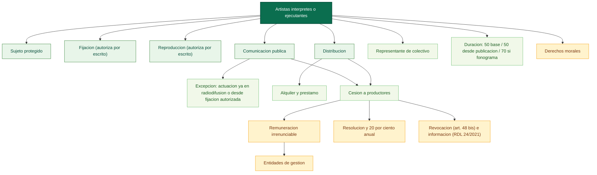

# Mapa conceptual base: artistas interpretes o ejecutantes (arts. 105-113)

Fuente base: [01_titulo_i_artistas_interpretes_o_ejecutantes.md](../../../LSI/titulo123_capitulos/01_titulo_i_artistas_interpretes_o_ejecutantes.md)

Relaciones base: [01_titulo_i_artistas_interpretes_o_ejecutantes_relaciones.md](../../../LSI/titulo123_capitulos/01_titulo_i_artistas_interpretes_o_ejecutantes_relaciones.md)

## Funcion dentro del mapa global

Este mapa es el nodo personal central de los derechos afines. Organiza la tension entre control del interprete sobre su actuacion, cesion al productor, remuneraciones irrenunciables, duracion y nucleo moral.

## Pregunta de enfoque

Como protege la ley al interprete entre su poder de autorizacion, la explotacion industrial de la fijacion, la intervencion de entidades de gestion y la persistencia de derechos morales?

## Desglose por articulos

- Art. 105: define al artista interprete o ejecutante e incluye al director de escena y al director de orquesta.
- Art. 106: reconoce el derecho exclusivo de autorizar la fijacion y exige forma escrita.
- Art. 107: reconoce el derecho exclusivo de reproduccion y permite transferencia, cesion o licencias contractuales.
- Art. 108: reconoce el derecho exclusivo de comunicacion publica y puesta a disposicion; excluye de ese derecho la actuacion que en si misma constituye una actuacion transmitida por radiodifusion o se realiza a partir de una fijacion previamente autorizada; presume la transferencia de la puesta a disposicion al productor salvo pacto; mantiene remuneraciones irrenunciables; impone remuneracion equitativa y unica por comunicacion publica de fonogramas comerciales; impone remuneracion por ciertos usos de grabaciones audiovisuales (art. 20.2.f y g); activa entidades de gestion para negociacion, recaudacion y distribucion.
- Art. 109: regula la distribucion y su agotamiento en la UE; define el alquiler como puesta a disposicion por tiempo limitado con beneficio economico y el prestamo como puesta a disposicion por tiempo limitado sin beneficio economico a traves de establecimientos accesibles al publico; mantiene remuneracion equitativa irrenunciable por alquiler cuando el derecho se ha transferido; hace efectiva esa remuneracion a traves de entidades de gestion.
- Art. 110: en contratos de trabajo o servicios presume adquisicion empresarial de ciertos derechos de reproduccion y comunicacion publica segun naturaleza y objeto del contrato; no afecta a las remuneraciones de los apartados 3, 4 y 5 del art. 108; vincula la remuneracion pactada al art. 47 de la ley; hace aplicables el derecho de revocacion del art. 48 bis y las obligaciones de informacion del art. 75 del RDL 24/2021 al cesionario o licenciatario.
- Art. 110 bis: si el fonograma no se explota suficientemente tras 50 años, el interprete puede resolver la cesion; si hubo remuneracion unica, nace una remuneracion anual adicional del 20 por ciento de los ingresos brutos de explotacion; no caben ciertas deducciones tras ese plazo.
- Art. 111: las actuaciones colectivas exigen representante designado por escrito.
- Art. 112: la duracion tiene tres tramos: 50 años desde la interpretacion como regla general; 50 años desde la primera publicacion o comunicacion licita si se publica por medio distinto al fonograma dentro del periodo inicial; 70 años desde la primera publicacion o comunicacion licita si se publica en fonograma.
- Art. 113: reconoce derecho moral al nombre e integridad, exige autorizacion para doblaje en lengua propia durante la vida y regula su ejercicio post mortem.

## Proposiciones nucleares

- Interprete -> autoriza -> fijacion.
- Interprete -> autoriza -> reproduccion.
- Interprete -> autoriza -> comunicacion publica.
- Contrato con productor -> puede presumir -> transferencia de puesta a disposicion o alquiler.
- Transferencia contractual -> no suprime -> remuneraciones irrenunciables.
- Comunicacion publica de fonograma comercial -> obliga a pagar -> remuneracion equitativa y unica.
- Entidades de gestion -> hacen efectiva -> recaudacion y reparto de remuneraciones.
- Falta de explotacion suficiente del fonograma tras 50 años -> activa -> resolucion del contrato de cesion.
- Remuneracion unica inicial -> genera despues -> remuneracion anual adicional del 20 por ciento.
- Actuacion colectiva -> exige -> representante.
- Grabacion publicada en fonograma -> extiende duracion a -> 70 años.
- Grabacion publicada por medio distinto al fonograma -> fija duracion en -> 50 años desde esa publicacion.
- Actuacion que constituye en si misma emision de radiodifusion o se realiza desde fijacion autorizada -> excluida de -> autorizacion de comunicacion publica del interprete.
- Remuneracion pactada en contrato de trabajo o servicios -> se sujeta a -> art. 47 de la ley.
- Interprete en contrato de cesion -> puede ejercer -> derecho de revocacion del art. 48 bis.
- Cesionario o licenciatario -> queda sujeto a -> obligaciones de informacion del art. 75 RDL 24/2021.
- Interprete -> conserva -> derecho al nombre, a la integridad y control del doblaje en lengua propia.

## Puentes de integracion

- [02_titulo_i_artistas_interpretes_o_ejecutantes_parcial_submapa.md](../titulo7/02_titulo_i_artistas_interpretes_o_ejecutantes_parcial_submapa.md): conserva el arranque documental de los arts. 105-108.
- [02_titulo_ii_productores_fonogramas_mapa.md](./02_titulo_ii_productores_fonogramas_mapa.md): comparte fonograma, remuneracion equitativa y explotacion industrial sonora.
- [03_titulo_iii_productores_grabaciones_audiovisuales_mapa.md](./03_titulo_iii_productores_grabaciones_audiovisuales_mapa.md): comparte fijacion audiovisual y comunicacion publica.
- [04_titulo_iv_entidades_radiodifusion_mapa.md](./04_titulo_iv_entidades_radiodifusion_mapa.md): conecta con la difusion de actuaciones mediante emisiones y retransmisiones.

## Diagrama base

