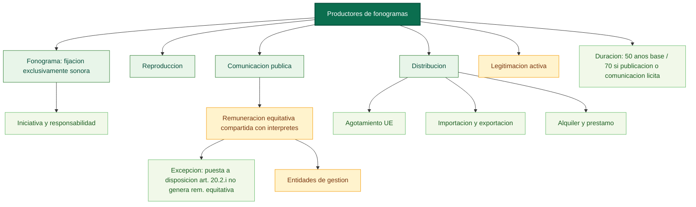

# Mapa conceptual base: productores de fonogramas (arts. 114-119)

Fuente base: [02_titulo_ii_productores_fonogramas.md](../../../LSI/titulo123_capitulos/02_titulo_ii_productores_fonogramas.md)

Relaciones base: [02_titulo_ii_productores_fonogramas_relaciones.md](../../../LSI/titulo123_capitulos/02_titulo_ii_productores_fonogramas_relaciones.md)

## Funcion dentro del mapa global

Este mapa desplaza el foco desde la actuacion personal hacia el agente empresarial que impulsa y controla la fijacion sonora. Es el nodo empresarial del eje fonograma.

## Pregunta de enfoque

Como protege la ley al productor de fonogramas como sujeto de iniciativa economica y como coordina sus derechos con los del interprete y con la comunicacion publica del fonograma?

## Desglose por articulos

- Art. 114: define el fonograma como fijacion exclusivamente sonora e identifica al productor como quien asume iniciativa y responsabilidad de la primera fijacion.
- Art. 115: reconoce el derecho exclusivo de reproduccion y su posible cesion o licencia.
- Art. 116: reconoce el derecho exclusivo de comunicacion publica incluyendo la puesta a disposicion del art. 20.2.i); impone remuneracion equitativa y unica por el uso de fonogramas comerciales en cualquier forma de comunicacion publica, excepto la puesta a disposicion del art. 20.2.i); fija el reparto por partes iguales a falta de acuerdo entre productores e interpretes; canaliza su efectividad mediante entidades de gestion.
- Art. 117: reconoce el derecho exclusivo de distribucion y su agotamiento en la UE; incluye la facultad de autorizar importacion y exportacion con fines comerciales; define el alquiler como la puesta a disposicion por tiempo limitado con beneficio economico, excluyendo la exposicion, la comunicacion publica desde fonogramas y la consulta in situ; define el prestamo como la puesta a disposicion sin beneficio economico a traves de establecimientos accesibles al publico.
- Art. 118: atribuye legitimacion activa al productor y al cesionario ante infracciones de reproduccion y distribucion.
- Art. 119: fija la duracion general en 50 años desde la grabacion y la amplifica a 70 si hay publicacion o comunicacion licita al publico en plazo.

## Proposiciones nucleares

- Fonograma -> es -> fijacion exclusivamente sonora.
- Productor de fonogramas -> asume -> iniciativa y responsabilidad de la fijacion.
- Productor -> autoriza -> reproduccion.
- Productor -> autoriza -> comunicacion publica.
- Comunicacion publica del fonograma -> genera -> remuneracion equitativa y unica.
- Remuneracion equitativa -> se reparte entre -> productores e interpretes.
- Remuneracion equitativa -> se excluye cuando el uso es -> puesta a disposicion del art. 20.2.i.
- Entidades de gestion -> canalizan -> negociacion, recaudacion y distribucion de la remuneracion.
- Productor -> autoriza -> distribucion.
- Distribucion -> incluye -> importacion y exportacion comercial.
- Primera venta en la UE -> agota -> derecho de distribucion.
- Alquiler de fonogramas -> requiere -> autorizacion del productor.
- Prestamo de fonogramas -> se realiza a traves de -> establecimientos accesibles al publico sin beneficio economico.
- Productor o cesionario -> ejercitan -> acciones por infraccion.
- Fonograma grabado sin publicacion ni comunicacion -> dura -> 50 anos.
- Fonograma publicado o comunicado licitamente al publico dentro del periodo -> extiende duracion a -> 70 anos.

## Puentes de integracion

- [01_titulo_i_artistas_interpretes_o_ejecutantes_mapa.md](./01_titulo_i_artistas_interpretes_o_ejecutantes_mapa.md): comparte el reparto de remuneraciones y la explotacion de actuaciones grabadas.
- [03_titulo_iii_productores_grabaciones_audiovisuales_mapa.md](./03_titulo_iii_productores_grabaciones_audiovisuales_mapa.md): permite comparar la empresa sonora con la audiovisual.
- [04_titulo_iv_entidades_radiodifusion_mapa.md](./04_titulo_iv_entidades_radiodifusion_mapa.md): conecta cuando el fonograma entra en cadenas de difusion y comunicacion publica.

## Diagrama base

