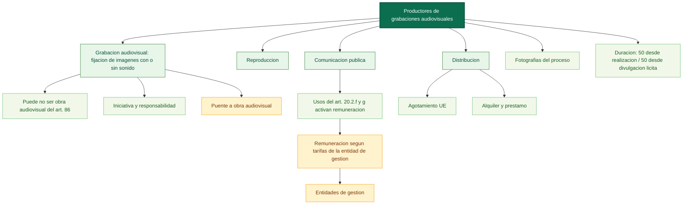

# Mapa conceptual base: productores de grabaciones audiovisuales (arts. 120-125)

Fuente base: [03_titulo_iii_productores_grabaciones_audiovisuales.md](../../../LSI/titulo123_capitulos/03_titulo_iii_productores_grabaciones_audiovisuales.md)

Relaciones base: [03_titulo_iii_productores_grabaciones_audiovisuales_relaciones.md](../../../LSI/titulo123_capitulos/03_titulo_iii_productores_grabaciones_audiovisuales_relaciones.md)

## Funcion dentro del mapa global

Este mapa organiza la dimension empresarial de la fijacion audiovisual. Funciona como nodo intermedio entre obra audiovisual, interpretacion fijada, explotacion economica y difusion posterior.

## Pregunta de enfoque

Como protege la ley al productor de la primera fijacion audiovisual y de que modo conecta ese estatuto con la obra audiovisual, la actuacion interpretativa y la explotacion de la grabacion?

## Desglose por articulos

- Art. 120: define grabacion audiovisual como fijacion de un plano o secuencia de imagenes, con o sin sonido, sea o no calificable como obra audiovisual en el sentido del art. 86; identifica al productor como la persona natural o juridica que tiene la iniciativa y asume la responsabilidad de la grabacion.
- Art. 121: reconoce el derecho exclusivo de reproduccion del original y sus copias y su posible cesion o licencia.
- Art. 122: reconoce el derecho de autorizar la comunicacion publica; impone remuneracion a los usuarios que utilicen grabaciones audiovisuales para los actos de comunicacion publica previstos en el art. 20.2.f y g, de acuerdo con las tarifas generales de la entidad de gestion; hace efectiva la remuneracion a traves de entidades de gestion.
- Art. 123: reconoce el derecho exclusivo de distribucion y su agotamiento en la UE; define el alquiler como puesta a disposicion por tiempo limitado con beneficio economico, excluyendo la exposicion, la comunicacion publica desde la fijacion y la consulta in situ; define el prestamo como puesta a disposicion sin beneficio economico a traves de establecimientos accesibles al publico.
- Art. 124: atribuye tambien al productor los derechos de explotacion sobre las fotografias realizadas durante el proceso de produccion de la grabacion audiovisual.
- Art. 125: fija la duracion general en 50 años desde la realizacion, computados desde el 1 de enero del año siguiente; si la grabacion se divulga licitamente dentro de ese periodo, los derechos duran 50 años desde la divulgacion, computados desde el 1 de enero del año siguiente a esa fecha.

## Proposiciones nucleares

- Grabacion audiovisual -> es -> fijacion de imagenes con o sin sonido.
- Grabacion audiovisual -> puede no ser -> obra audiovisual del art. 86.
- Productor audiovisual -> tiene -> iniciativa y responsabilidad.
- Productor audiovisual -> autoriza -> reproduccion.
- Productor audiovisual -> autoriza -> comunicacion publica.
- Comunicacion publica de grabaciones audiovisuales para actos del art. 20.2.f y g -> obliga al usuario a pagar -> remuneracion segun tarifas de la entidad de gestion.
- Entidades de gestion -> hacen efectiva -> la remuneracion correspondiente mediante negociacion, recaudacion y distribucion.
- Productor audiovisual -> autoriza -> distribucion.
- Primera venta en la UE -> agota -> derecho de distribucion.
- Alquiler de grabaciones audiovisuales -> requiere -> autorizacion del productor.
- Prestamo de grabaciones audiovisuales -> se realiza a traves de -> establecimientos accesibles al publico sin beneficio economico.
- Produccion audiovisual -> incluye tambien -> fotografias del proceso.
- Divulgacion licita dentro del periodo inicial -> reordena a 50 anos -> el computo desde la fecha de divulgacion.

## Puentes de integracion

- [00_preliminar_obras_audiovisuales_art_91_94_mapa.md](../titulo7/00_preliminar_obras_audiovisuales_art_91_94_mapa.md): enlaza la version definitiva con la fijacion explotable.
- [01_titulo_i_artistas_interpretes_o_ejecutantes_mapa.md](./01_titulo_i_artistas_interpretes_o_ejecutantes_mapa.md): comparte actuaciones fijadas y remuneracion por comunicacion publica.
- [04_titulo_iv_entidades_radiodifusion_mapa.md](./04_titulo_iv_entidades_radiodifusion_mapa.md): conecta cuando la grabacion pasa a sistemas de emision o retransmision.

## Diagrama base

