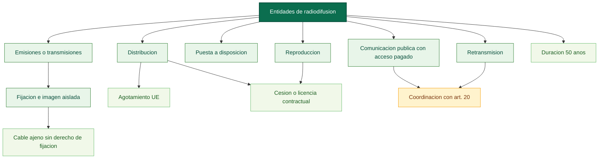

# Mapa conceptual base: entidades de radiodifusion (arts. 126-127)

Fuente base: [titulo123.md](../../../LSI/titulo123.md)

Apoyo sintetico: [resumen_markitdown_pdf.md](../../../LSI/resumen_markitdown_pdf.md)

## Funcion dentro del mapa global

Este mapa reincorpora la capa de proteccion sobre la senal emitida o transmitida. Su funcion es cerrar el circuito de los derechos afines con un sujeto distinto del autor, del interprete y del productor: la entidad que organiza y difunde la emision.

## Pregunta de enfoque

Como protege la ley a la entidad de radiodifusion sobre sus emisiones o transmisiones y como conecta esa proteccion con la fijacion, la retransmision, la comunicacion publica y la distribucion de las fijaciones?

## Desglose por articulos

- Art. 126: reconoce a la entidad de radiodifusion el derecho exclusivo de autorizar la fijacion de sus emisiones o transmisiones, incluida la fijacion de imagenes aisladas difundidas en ellas.
- Art. 126: excluye de ese derecho de fijacion a las empresas de distribucion por cable cuando solo retransmiten emisiones ajenas.
- Art. 126: reconoce reproduccion, puesta a disposicion, retransmision, comunicacion publica en lugares de acceso pagado y distribucion de las fijaciones.
- Art. 126: permite transferencia, cesion o licencia contractual al menos en reproduccion y distribucion.
- Art. 126: somete la comunicacion publica via satelite o cable a la coordinacion con el art. 20 de la ley.
- Art. 126: establece agotamiento en la UE para la distribucion de las fijaciones tras la primera venta autorizada.
- Art. 126: define emision, transmision y retransmision por remision expresa al art. 20.
- Art. 127: fija la duracion en 50 anos desde el 1 de enero del ano siguiente a la primera emision o transmision.

## Proposiciones nucleares

- Entidad de radiodifusion -> autoriza -> fijacion de sus emisiones o transmisiones.
- Fijacion de la emision -> incluye -> imagen aislada difundida.
- Empresa de cable que solo retransmite emisiones ajenas -> no goza de -> derecho de fijacion.
- Entidad de radiodifusion -> autoriza -> reproduccion de las fijaciones.
- Entidad de radiodifusion -> autoriza -> puesta a disposicion del publico.
- Entidad de radiodifusion -> autoriza -> retransmision por cualquier procedimiento tecnico.
- Comunicacion publica en lugares de acceso pagado -> requiere -> autorizacion de la entidad.
- Distribucion de fijaciones -> se agota con -> primera venta autorizada en la UE.
- Reproduccion y distribucion -> pueden ser objeto de -> cesion o licencia contractual.
- Emision, transmision y retransmision -> se coordinan con -> art. 20 de la ley.
- Derechos de radiodifusion -> duran -> 50 anos.

## Puentes de integracion

- [00_preliminar_obras_audiovisuales_art_91_94_mapa.md](../titulo7/00_preliminar_obras_audiovisuales_art_91_94_mapa.md): conecta con los ajustes tecnicos para radiodifusion sobre la version definitiva.
- [01_titulo_i_artistas_interpretes_o_ejecutantes_mapa.md](./01_titulo_i_artistas_interpretes_o_ejecutantes_mapa.md): la difusion de actuaciones puede materializarse por emisiones y retransmisiones.
- [02_titulo_ii_productores_fonogramas_mapa.md](./02_titulo_ii_productores_fonogramas_mapa.md): enlaza cuando un fonograma entra en circuitos de comunicacion publica o difusion.
- [03_titulo_iii_productores_grabaciones_audiovisuales_mapa.md](./03_titulo_iii_productores_grabaciones_audiovisuales_mapa.md): enlaza cuando la grabacion se incorpora a emisiones o retransmisiones.

## Diagrama base

