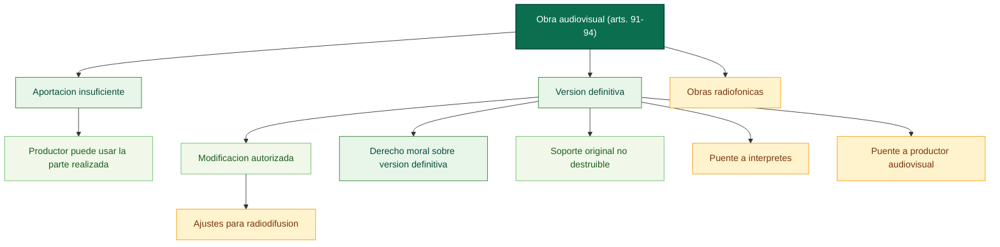

# Submapa conceptual: obras audiovisuales (arts. 91-94)

Fuente base: [00_preliminar_obras_audiovisuales_art_91_94.md](../../../LSI/titulo7_capitulos/00_preliminar_obras_audiovisuales_art_91_94.md)

Relaciones base: [00_preliminar_obras_audiovisuales_art_91_94_relaciones.md](../../../LSI/titulo7_capitulos/00_preliminar_obras_audiovisuales_art_91_94_relaciones.md)

## Funcion dentro del mapa global

Este submapa cierra el regimen de la obra audiovisual y prepara el paso hacia los derechos afines. Su valor principal es fijar el nodo version definitiva, que despues se conecta con interpretacion, fijacion audiovisual y radiodifusion.

## Pregunta de enfoque

Como se cierra juridicamente la obra audiovisual y que conceptos sirven de puente hacia la proteccion de actuaciones, fijaciones y emisiones?

## Desglose por articulos

- Art. 91: si un autor no completa su aportacion por negativa injustificada o por fuerza mayor, el productor puede utilizar la parte ya realizada, respetando sus derechos e indemnizacion.
- Art. 92: la obra audiovisual se considera terminada cuando existe version definitiva pactada entre director-realizador y productor.
- Art. 92: cualquier modificacion de la version definitiva exige autorizacion de quienes la fijaron; para obras destinadas esencialmente a radiodifusion se presumen permitidas las modificaciones estrictamente exigidas por la programacion, salvo pacto en contrario.
- Art. 93: el derecho moral de los autores solo se ejercita sobre la version definitiva.
- Art. 93: se prohibe destruir el soporte original de la version definitiva.
- Art. 94: las obras radiofonicas reciben aplicacion analogica del regimen audiovisual.

## Proposiciones nucleares

- Aportacion incompleta de un autor -> no bloquea siempre -> uso parcial por el productor.
- Productor -> puede usar la parte realizada -> si respeta los derechos del autor ausente.
- Obra audiovisual -> se considera terminada cuando -> existe version definitiva.
- Version definitiva -> solo puede modificarse si -> autorizan quienes la fijaron.
- Modificaciones tecnicas para radiodifusion -> se presumen admitidas cuando -> las exige la programacion del medio.
- Derecho moral de los autores -> se concentra en -> version definitiva.
- Soporte original -> no puede ser -> destruido.
- Obras radiofonicas -> reciben aplicacion de -> regimen audiovisual.

## Puentes de integracion

- [01_titulo_i_artistas_interpretes_o_ejecutantes_mapa.md](../titulo123/01_titulo_i_artistas_interpretes_o_ejecutantes_mapa.md): la version definitiva incorpora actuaciones protegidas.
- [03_titulo_iii_productores_grabaciones_audiovisuales_mapa.md](../titulo123/03_titulo_iii_productores_grabaciones_audiovisuales_mapa.md): la obra terminada presupone una fijacion audiovisual explotable.
- [04_titulo_iv_entidades_radiodifusion_mapa.md](../titulo123/04_titulo_iv_entidades_radiodifusion_mapa.md): las modificaciones para programacion enlazan con la logica de emision y transmision.

## Diagrama base

