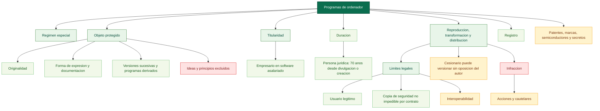

# Mapa conceptual base: programas de ordenador (arts. 95-104)

Fuente base: [01_titulo_vii_programas_de_ordenador.md](../../../LSI/titulo7_capitulos/01_titulo_vii_programas_de_ordenador.md)

Relaciones base: [01_titulo_vii_programas_de_ordenador_relaciones.md](../../../LSI/titulo7_capitulos/01_titulo_vii_programas_de_ordenador_relaciones.md)

## Funcion dentro del mapa global

Este mapa es el eje fuerte del bloque informatico. Organiza la secuencia completa del software: objeto protegido, titularidad, explotacion, limites, registro, infraccion y tutela.

## Pregunta de enfoque

Como articula la ley la proteccion del software desde su definicion y titularidad hasta los limites del usuario legitimo, la interoperabilidad y la tutela frente a la infraccion?

## Desglose por articulos

- Art. 95: fija un regimen especial del software dentro de la ley y remite al resto de la norma en lo no previsto especificamente.
- Art. 96: define programa de ordenador como toda secuencia de instrucciones destinadas a ser utilizadas directa o indirectamente en un sistema informatico; incluye documentacion preparatoria, documentacion tecnica y manuales con la misma proteccion; exige originalidad como creacion intelectual propia; protege la forma de expresion y las versiones sucesivas del programa y los programas derivados, salvo los creados para ocasionar efectos nocivos; excluye ideas y principios; admite concurrencia con propiedad industrial.
- Art. 97: determina la titularidad en cinco supuestos: autoria individual, obra colectiva (el editor como autor salvo pacto), autoria en colaboracion, y software asalariado donde la explotacion corresponde al empresario salvo pacto.
- Art. 98: distingue la duracion segun la naturaleza del autor: persona natural, la prevista en el Titulo III del Libro Primero; persona juridica, 70 anos computados desde el 1 de enero del ano siguiente al de la divulgacion licita o al de la creacion si no se hubiera divulgado.
- Art. 99: concreta reproduccion total o parcial incluso transitoria, transformacion y distribucion publica incluido el alquiler; presume la cesion de uso no exclusiva e intransferible para satisfacer necesidades del usuario; establece agotamiento de la primera venta en la UE salvo subsiguiente alquiler.
- Art. 100: introduce limites para uso necesario, correccion de errores, copia de seguridad (no puede impedirse por contrato), observacion del funcionamiento, y descompilacion indispensable para interoperabilidad bajo condiciones estrictas; el apartado 4 establece que el cesionario titular de derechos de explotacion puede realizar o autorizar versiones sucesivas y programas derivados salvo pacto en contrario con el autor.
- Art. 101: permite la inscripcion registral del programa, de sus versiones y de programas derivados.
- Art. 102: define supuestos de infraccion por actos no autorizados, copias ilegitimas y herramientas de neutralizacion tecnica.
- Art. 103: habilita acciones, procedimientos y medidas cautelares.
- Art. 104: aclara la convivencia con patentes, marcas, competencia desleal, secretos comerciales, semiconductores y derecho de obligaciones.

## Proposiciones nucleares

- Programa de ordenador -> se protege si -> es original.
- Proteccion del software -> recae sobre -> forma de expresion y documentacion asociada.
- Versiones sucesivas y programas derivados -> quedan protegidas -> salvo las creadas para causar efectos nocivos.
- Ideas y principios -> quedan fuera de -> proteccion autoral.
- Programa creado por trabajador -> atribuye explotacion a -> empresario salvo pacto.
- Autor persona juridica -> tiene derechos por -> 70 anos desde divulgacion licita o desde la creacion si no se divulgo.
- Derechos de explotacion -> incluyen -> reproduccion, transformacion y distribucion.
- Cesion de uso del programa -> se presume -> no exclusiva e intransferible.
- Distribucion en la UE -> se agota con -> primera venta autorizada salvo alquiler.
- Usuario legitimo -> puede realizar -> actos necesarios para usar el programa.
- Usuario legitimo -> puede observar y estudiar -> funcionamiento del programa.
- Copia de seguridad -> no puede ser impedida -> por contrato.
- Descompilacion -> solo se permite para -> interoperabilidad.
- Cesionario titular de explotacion -> puede versionar o derivar el programa -> sin oposicion del autor salvo pacto.
- Infraccion -> habilita -> acciones y medidas cautelares.
- Regimen del software -> convive con -> otras ramas juridicas.

## Puentes de integracion

- [00_preliminar_programas_ordenador_art_103_104_mapa.md](../titulo123/00_preliminar_programas_ordenador_art_103_104_mapa.md): concentra la tutela y la concurrencia normativa como cierre del eje software.
- [01_titulo_i_artistas_interpretes_o_ejecutantes_mapa.md](../titulo123/01_titulo_i_artistas_interpretes_o_ejecutantes_mapa.md): comparte el patron derechos exclusivos -> cesion -> remuneracion -> duracion -> tutela.
- [04_titulo_iv_entidades_radiodifusion_mapa.md](../titulo123/04_titulo_iv_entidades_radiodifusion_mapa.md): permite una futura capa tecnologica comun sobre acceso, distribucion y comunicacion al publico.

## Diagrama base

