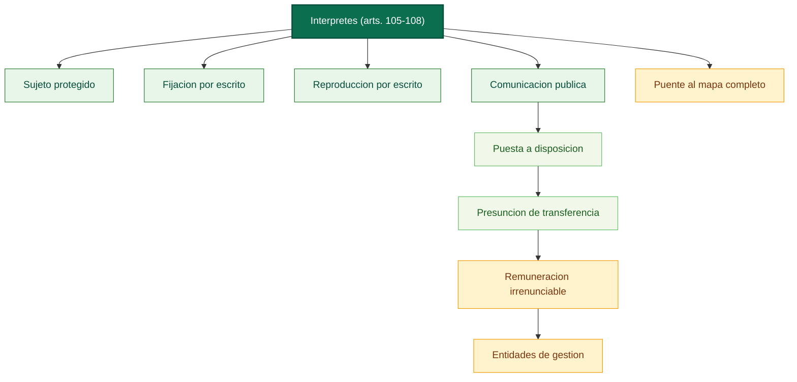

# Submapa conceptual: nucleo inicial de interpretes (arts. 105-108)

Fuente base: [02_titulo_i_artistas_interpretes_o_ejecutantes_parcial.md](../../../LSI/titulo7_capitulos/02_titulo_i_artistas_interpretes_o_ejecutantes_parcial.md)

Relaciones base: [02_titulo_i_artistas_interpretes_o_ejecutantes_parcial_relaciones.md](../../../LSI/titulo7_capitulos/02_titulo_i_artistas_interpretes_o_ejecutantes_parcial_relaciones.md)

## Funcion dentro del mapa global

Este submapa conserva el arranque del regimen de artistas interpretes o ejecutantes tal como aparece en el primer PDF. No sustituye al mapa completo del Titulo I, pero preserva la procedencia y el detalle del tramo 105-108.

## Pregunta de enfoque

Como se define el sujeto protegido y cual es el nucleo inicial de facultades del interprete antes de entrar en distribucion, duracion y derechos morales?

## Desglose por articulos

- Art. 105: define al artista interprete o ejecutante e incluye al director de escena y al director de orquesta.
- Art. 106: atribuye al interprete el derecho exclusivo de autorizar la fijacion por escrito.
- Art. 107: atribuye el derecho exclusivo de reproduccion y permite transferencia, cesion o licencia.
- Art. 108: reconoce el derecho exclusivo de comunicacion publica y puesta a disposicion; presume transferencia de la puesta a disposicion al productor salvo pacto; mantiene remuneracion irrenunciable; obliga al pago de remuneraciones equitativas por comunicacion publica; canaliza su efectividad a traves de entidades de gestion.

## Proposiciones nucleares

- Persona que representa, canta, lee, recita, interpreta o ejecuta -> es -> artista interprete o ejecutante.
- Director de escena y director de orquesta -> reciben -> mismo estatuto protector.
- Interprete -> autoriza por escrito -> fijacion.
- Interprete -> autoriza por escrito -> reproduccion.
- Interprete -> autoriza -> comunicacion publica.
- Contrato con productor -> puede presumir -> transferencia de puesta a disposicion.
- Transferencia contractual -> no elimina -> remuneracion irrenunciable.
- Usuarios de fonogramas comerciales -> deben pagar -> remuneracion equitativa y unica.
- Entidades de gestion -> aseguran -> negociacion, recaudacion y distribucion.

## Puentes de integracion

- [01_titulo_i_artistas_interpretes_o_ejecutantes_mapa.md](../titulo123/01_titulo_i_artistas_interpretes_o_ejecutantes_mapa.md): absorbe este submapa y desarrolla distribucion, contratos, duracion y derechos morales.
- [02_titulo_ii_productores_fonogramas_mapa.md](../titulo123/02_titulo_ii_productores_fonogramas_mapa.md): comparte el eje fonograma -> comunicacion publica -> remuneracion equitativa.
- [03_titulo_iii_productores_grabaciones_audiovisuales_mapa.md](../titulo123/03_titulo_iii_productores_grabaciones_audiovisuales_mapa.md): conecta por la fijacion audiovisual de actuaciones.

## Diagrama base

