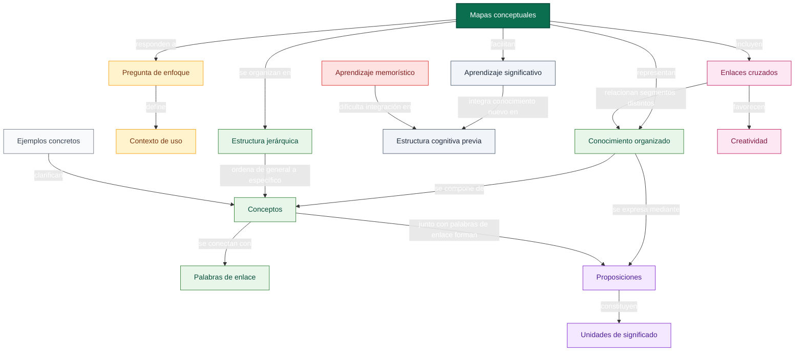
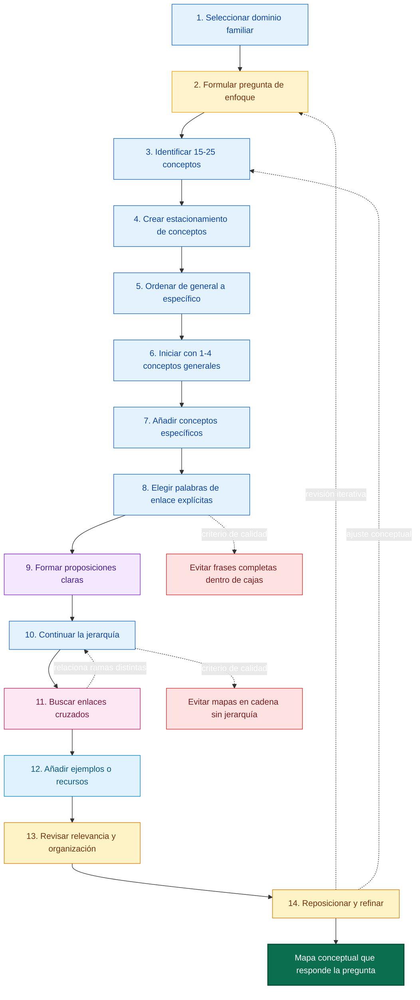
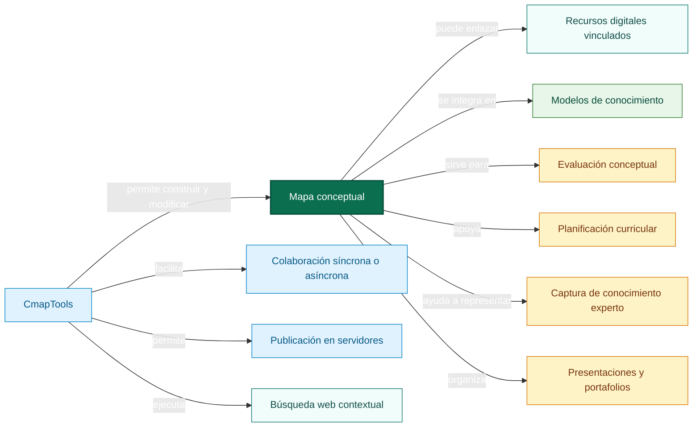

# 2_esquemas_drawio.md

## Contenidos esenciales

### Conceptos fundamentales

- Mapa conceptual: herramienta gráfica para organizar y representar conocimiento.
- Concepto: regularidad percibida en acontecimientos u objetos, designada mediante una etiqueta.
- Etiqueta: palabra o símbolo que nombra un concepto.
- Palabras de enlace: expresiones que especifican la relación entre dos conceptos.
- Proposición: unidad de significado formada por dos o más conceptos conectados mediante palabras de enlace.
- Conocimiento organizado: estructura compuesta por conceptos y proposiciones relacionados.
- Pregunta de enfoque: pregunta que delimita el problema, contexto y propósito del mapa.
- Jerarquía conceptual: organización desde conceptos generales e inclusivos hacia conceptos específicos.
- Enlaces cruzados: relaciones entre conceptos ubicados en diferentes secciones del mapa.
- Aprendizaje significativo: integración de nuevos conceptos y proposiciones en la estructura cognitiva previa.
- Aprendizaje memorístico: incorporación débil o aislada de información, con baja transferencia.
- CmapTools: software para construir, revisar, compartir, publicar y enriquecer mapas conceptuales.
- Modelo de conocimiento: conjunto de mapas conceptuales y recursos digitales conectados sobre un dominio.
- Evaluación conceptual: uso del mapa para diagnosticar comprensión, errores conceptuales y progreso.

### Relaciones teóricas clave

- Los mapas conceptuales representan conocimiento organizado.
- El conocimiento organizado está compuesto por conceptos y proposiciones.
- Los conceptos se conectan mediante palabras de enlace.
- Los conceptos y palabras de enlace forman proposiciones.
- Las proposiciones funcionan como unidades de significado.
- La pregunta de enfoque define el contexto y orienta la selección de conceptos.
- La jerarquía conceptual ordena el mapa desde lo general hacia lo específico.
- Los enlaces cruzados muestran relaciones entre segmentos distintos del mapa.
- Los enlaces cruzados favorecen creatividad y comprensión profunda.
- El aprendizaje significativo integra conocimiento nuevo con conocimiento previo.
- Los mapas conceptuales facilitan aprendizaje significativo, evaluación y planificación curricular.
- CmapTools amplía el mapa con colaboración, recursos digitales, búsqueda web y comparación de mapas.

## Guía de estilo para draw.io

### Figuras

- Concepto principal: rectángulo redondeado grande.
- Concepto general: rectángulo redondeado.
- Concepto específico: rectángulo redondeado pequeño.
- Pregunta de enfoque: paralelogramo o llamada.
- Proposición: rectángulo con borde destacado.
- Palabra de enlace: etiqueta sobre el conector, no como nodo principal.
- Enlace cruzado: conector curvo o diagonal.
- Recurso digital: icono de documento, enlace o cilindro.
- Proceso o paso: rectángulo numerado.
- Advertencia o criterio de calidad: rombo.
- Ejemplo concreto: nota o documento con borde discontinuo.

### Colores recomendados

- Concepto raíz: fondo #0B6E4F, borde #064E3B, texto #FFFFFF.
- Conceptos generales: fondo #E8F5E9, borde #2E7D32, texto #064E3B.
- Conceptos específicos: fondo #F1F8E9, borde #66BB6A, texto #1B5E20.
- Pregunta de enfoque: fondo #FFF3CD, borde #F59E0B, texto #78350F.
- Proposiciones: fondo #F3E8FF, borde #7E22CE, texto #4C1D95.
- Enlaces cruzados: línea #BE185D, estilo discontinuo.
- Procesos de construcción: fondo #E3F2FD, borde #1565C0, texto #0D47A1.
- Recursos CmapTools: fondo #E0F2FE, borde #0284C7, texto #075985.
- Evaluación y revisión: fondo #FEF3C7, borde #D97706, texto #78350F.
- Ejemplos: fondo #F9FAFB, borde #6B7280, texto #374151.

### Conectores

- Relación conceptual normal: línea continua con flecha simple.
- Relación jerárquica: línea vertical descendente, de general a específico.
- Palabra de enlace: texto breve sobre la línea, preferentemente verbo o frase verbal.
- Enlace cruzado: línea discontinua o curva entre ramas distintas.
- Revisión iterativa: línea punteada de retorno.
- Secuencia de construcción: flechas numeradas de izquierda a derecha o de arriba abajo.

## Estructura para importación en draw.io

### Diagrama 1: estructura teórica del mapa conceptual

### Diagrama 2: procedimiento para construir un buen mapa conceptual

### Diagrama 3: usos de CmapTools y mapas conceptuales

